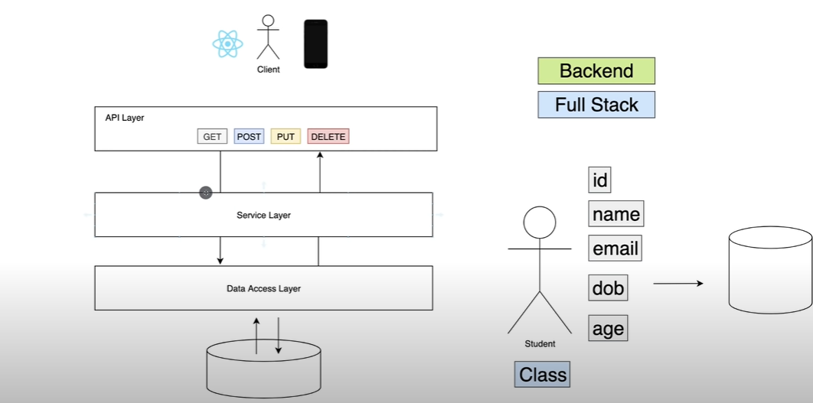

## A Simple REST Application using Springboot utilising Java-Maven

### Methods to Run the Code

#### 1. To run the code(Using Maven):

1. Install the dependencies needed to run the application and also downloading SNAPSHOT of production application
   `mvn install`

2. After Installing using java command run the generated SNAPSHOT.jar file
   `java -jar .\target\demo-0.0.1-SNAPSHOT.jar`

#### 2. To run the local springboot application:

1. Directly run the `DemoApplication.java` to locally run the code and to publish changes as well

#### Architecture of Application

